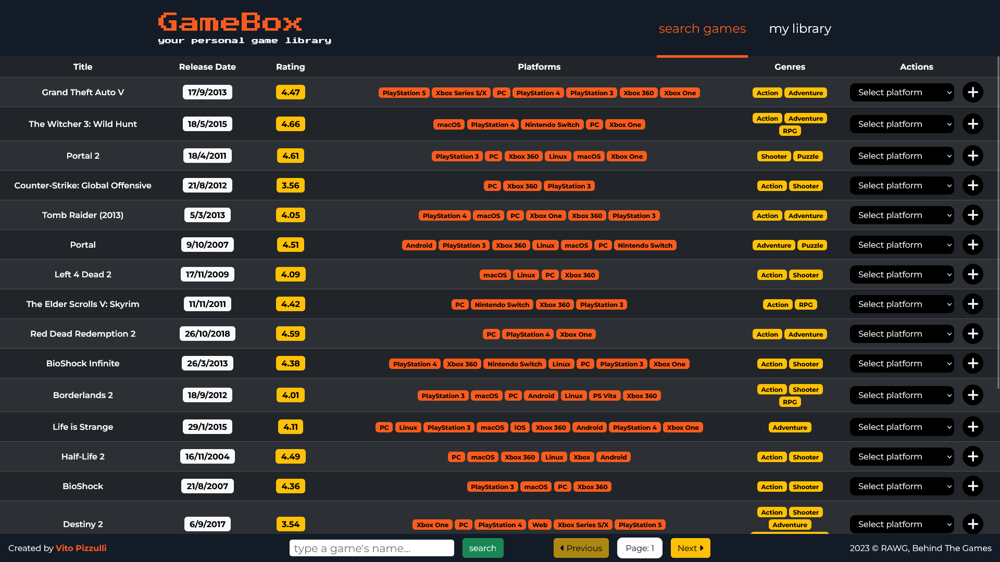

# GameBox

## Descrizione
GameBox è una web-app che rappresenta la soluzione ideale per organizzare la propria collezione di videogiochi. E' possibile aggiungere qualsiasi videogioco esistente alla propria libreria, selezionando la piattaforma per la quale lo si possiede. La propria libreria è visualizzabile in qualsiasi momento, ed è possibile rimuovere una piattaforma per un determinato videogioco o cancellarlo completamente.

## Funzionalità
- Ricerca di un videogioco per nome o visualizzazione di tutti i videogiochi disponibili, con i risultati organizzati in pagine.
- Aggiunta di un videogioco alla libreria personale, scegliendone la piattaforma.
- Visualizzazione della libreria personale, con i giochi posseduti e le rispettive piattaforme indicate.
- Rimozione di una piattaforma o eliminazione di un videogioco dalla libreria personale.

## Tecnologie utilizzate
- Node.js
- Express
- EJS
- Body Parser
- postgreSQL
- Axios
- dotenv
- session
- flash

## Installazione e avvio locale
1. Assicurati di avere Node.js installato sul tuo computer.
2. Clona o scarica il repository del progetto sul tuo computer.
3. Naviga nella directory del progetto tramite il terminale.
4. Apri il terminale e digita `npm install` per installare tutte le dipendenze necessarie.
5. Assicurati di avere PostgreSQL e pgAdmin installati sul tuo computer.
6. Crea un database PostgreSQL e inserisci i dati di connessione nel file `.env` nella cartella del progetto. Puoi usare il file `.env.example` come modello e modificare le variabili d'ambiente. E' necessario inserire una propria API Key, ottenibile al seguente link: https://rawg.io/apidocs.
7. Esegui le query contenute nel file queries.sql con pgAdmin, in modo da creare tutte le tabelle necessarie.
8. Avvia il server locale con il seguente comando: `node index.js`.

## Come utilizzare
1. Apri il tuo browser e vai all'indirizzo `localhost:3000` per utilizzare l'applicazione.
2. Sulla pagina principale puoi scegliere se visualizzare tutti i giochi disponibili cliccando su `show all games` oppure cercare un gioco per nome digitando il testo nella casella e cliccando su `search`. I risultati saranno visualizzati in una tabella, divisi per pagine.
3. Per aggiungere un videogioco alla tua libreria personale, seleziona una delle piattaforme e clicca sul simbolo `+`. Verrai reindirizzato alla pagina principale e vedrai un messaggio di conferma in alto.
4. Per visualizzare la tua libreria personale, clicca sul link `my library` nell'header. Verranno mostrati tutti i giochi che hai aggiunto alla libreria, con le piattaforme che hai scelto. Puoi ritornare alla pagina di ricerca cliccando sul link `search games` nell'header.
5. Per rimuovere una piattaforma da un gioco, selezionala e clicca su `Remove` La piattaforma verrà eliminata e vedrai un messaggio di conferma in alto. Nel caso un videogioco non sia associato ad altre piattaforme, verrà eliminato anch'esso.
6. Per eliminare completamente un gioco dalla tua libreria, clicca su `Delete`. Il gioco verrà rimosso dalla tua libreria e vedrai un messaggio di conferma in alto.